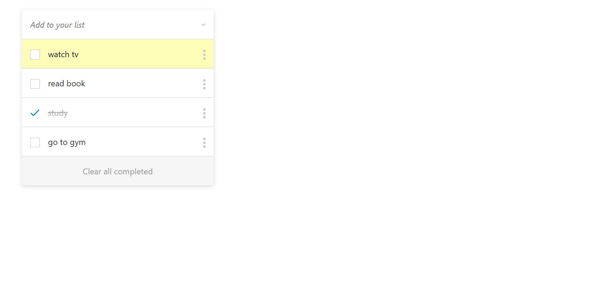

# To Do List Project

- Web app to keep track of tasks with add / remove / edit functionality.
- Data is stored in LocalStorage

## Built With

- HTML, SCSS, JS, Webpack

## Live Demo

[Live Demo Link](https://damdafayton.github.io/to-do-list/dist)

## Getting Started

- To run: download `\dist` folder and click `index.html`.
- To test :
    - `npm install jest --global`
    - `$ jest`

## Authors

👤 **damdafayton**

- [Github](https://github.com/damdafayton)
- [LinkedIn](https://linkedin.com/in/damdafayton)

## 🤝 Contributing

Contributions, issues, and feature requests are welcome!

Feel free to check the [issues page](../../issues/).

## Show your support

Give a ⭐️ if you like this project!

## 📝 License

This project is [MIT](./MIT.md) licensed.
